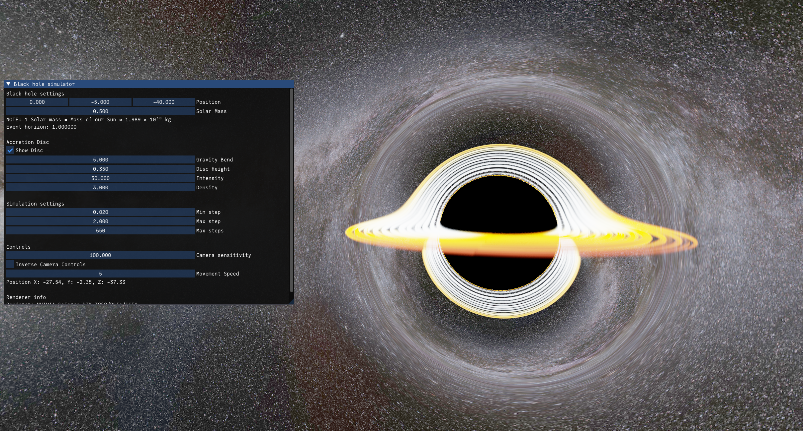

# Black Hole Simulator

A real-time gravitational lensing simulation using OpenGL.



**[🌌 View Live Demo](https://blackhole.soep.tech)**

## Build Instructions

### Using the build script

The easiest way to build the project is to use the provided `build.sh` script.

```bash
./build.sh
```

You can also specify the build type (Debug, Release, RelWithDebInfo, MinSizeRel) and run the application after building:

```bash
./build.sh Release --run
```

For more options, see the script's help message:

```bash
./build.sh --help
```

### Manual build

If you prefer to build the project manually, you can use CMake:

1.  Create a build directory:

    ```bash
    mkdir build
    cd build
    ```

2.  Configure CMake (specifying the build type is recommended):

    ```bash
    cmake .. -DCMAKE_BUILD_TYPE=Release
    ```

3.  Build the project:

    ```bash
    cmake --build .
    ```

4.  Run the executable:
    ```bash
    ./bin/Release/black_hole_simulator
    ```

### Web Build (Docker)

To build the WebAssembly version and serve it locally, you can use the provided Dockerfile. This handles the Emscripten toolchain and dependencies automatically.

1. **Build the Docker image:**

   ```bash
   docker build -t blackhole-sim .
   ```

2. **Run the container:** This compiles the project and starts a local Python server.

   ```bash
   docker run -p 8000:8000 blackhole-sim
   ```

## Controls

### Camera Movement

- **Move Forward:** `W`
- **Move Backward:** `S`
- **Strafe Left:** `A`
- **Strafe Right:** `D`
- **Move Up:** `Space`
- **Move Down:** `Left Control`

### Camera Rotation

- **Rotate:** Hold down the **right mouse button** and move the mouse to look around.

You can adjust the camera sensitivity and movement speed, and invert the camera controls in the application's UI window.
